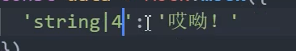
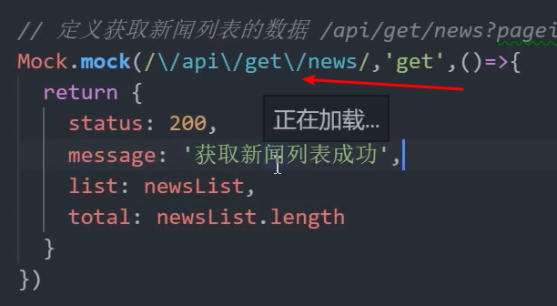

- 作用: 
  - 模拟数据, 拦截 Ajax 请求
- 使用方式: 
- 
- cnpm i mockjs  安装mockjs
- 
-  生产四个 哎呦 的字符串
-  生成中文文字
-  生成3-10范围的文本,  只有三表示只生成3个长度的
-  生成title 和句子
-  生成一个段落
-  表示生成五句段落
-  生成1-100之间的随机数
-  生成一个增量的
-  生成姓名, 身份证, 地址
- 生成图片
- 
-  大小, 背景色, 前景色, 格式, 图片文字
-  生成时间
-  生成一个list的数组, 8 个元素, 可以不固定长度
-  定义一个接口, get请求
-  直接通过axios 发送请求
-  常用的方式
-  去main.js中引入
- 根据后台返回的类型
-  较为完成的mockjs
-  通过get 中params 传参, get中使用的是params , post 使用的是data 
-  会出现该问题, 地址不对应了
-  通过正则的方式来改写之前的地址
-  获取到query参数
-  获取query参数的方式, 手动写
-  获取query方法
-  实现分页, 截取数据
-  
- post请求的
-  通过post 实现添加功能
-  mock模拟post请求, 获取body参数
-  删除的模拟
-  通过mock 实现删除