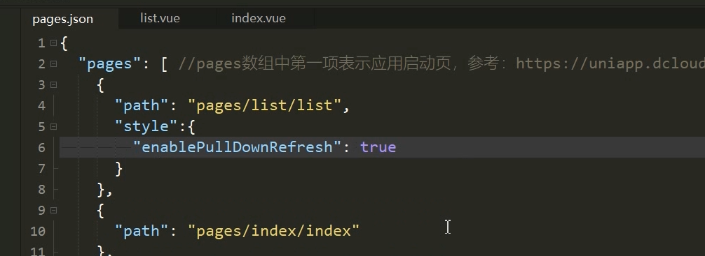
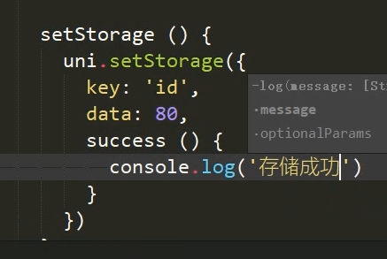
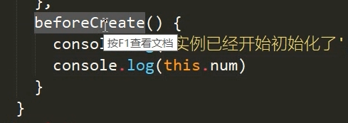
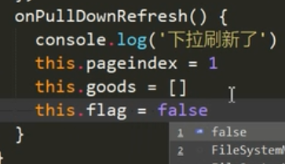

# uni-app

## 	需要安装工具


## 通过hbuilder 创建uniapp


## 运行到浏览器


##  第一次运行的时候要注意


- 设置ide, 微信小程序的地址
- 配置服务端口
- 

## 开发规范


## 设置顶部tabbar


- 在pages.json中写入
- 
- 顶部文字只能是黑白
- 
- 开启下拉

## 单独配置每一个页面样式


## 单独配置h5的样式


## tabbar的配置


## 配置调试默认打开页面


页面参数

## 组件的使用

- text 组件
- 
- view 组件
- 
- 指定按下去的样式 hover-class
- 类似阻止冒泡
- 2s后开始,, 松开之后2s才开始

## 在img中控制它的纵横比

```css
1. object-fit: contain;
2. width: 100%;
```

## uniapp样式


- 750rpx 也就是 整个屏幕的宽度
- 也可以给字体设置


- 导入外部css
- 
- uniapp 不能使用*, 
- 
- 推荐使用~@的方式引入
- 总结使用方式: 
  - 将字体图标文件导入, 然后使用@import 在 App.vue 中的style 中导入, 
  - 如果想使用scss预编译器, 可以通过以下方式安装
  - 
  - 全局的scss样式变量
  - 

## 动态数据绑定

- 差值绑定

  - ```js
    {{msg}}
    ```

- v-bind

  - 

- uniapp 事件

  - 传参的时候拿到事件对象
  - 

## 生命周期

**应用的生命周期**

- 
- onlaunch只会出发一次, 但是onshow, 从后台进入前台都会出发

**页面的生命周期**


- onload 可以拿到上一个页面传递过来的参数
- 
- tabbar中的, 已经显示过的将不会触发onload生命周期
- 下拉刷新
- 
- 这种方式是全局的开启页面刷新
- 
- 单个页面配置下拉刷新
- 
- 下拉刷新
- 
- 下拉刷新完毕后关闭下拉刷新
- 手动触发下拉刷新
- 
- 监听页面到达底部的事件
- 
- 配置pages.json中配置距离底部多少触发触底事件
- 

## 配置request


- 搭建本地接口
  - 安装phpstudy
  - 发送请求
  - 

## 设置缓存


- 表示同步的sync
- 
- 获取数据
- 
-  同步的方式 推荐使用
- 
- 

## 上传图片和预览图片

- 上传图片的方式
- 
- 小程序可以限制长传的数量, 但是浏览器不能
- 预览图片
- 
- 

## 条件注释


- 只能在h5中显示
- 
- 在js中写入
- 
- 样式
- 

## 导航跳转

- 申明式导航
- 
- 如果想跳转到tab页需要进行如下设置
- 
- 
- 设置为redirect的时候将不能再返回, 并且页面会卸载, 销毁掉
- 
- 编程式导航
- 
- 
- 跳转到tabbar页面并且关闭其他非tabbar页面
- 
- 跳转到详情并且关闭当前页面
- 
- 传参
- 编程式
- 
- 通过以下方式获取参数
- 

## 组件

- 组件的创建
  - 
  - 和vue类似
- 组件中的生命周期
- 此时实例已经开始初始化了, 但是数据还没有初始化完毕
- -
- created 表示实力创建完成, 也就是该组件创建成功, 但是还没有挂在到页面上
- 
- 挂载之前
- 

## 组件的通信

- 父传子
- props, v-bind
- this.$emit(myEvent, this.number') , 通过@myEvent监听

## uni-ui

- 点击下载
- 


# 项目

- 封装request请求
- 
- 
- 推荐设计人员使用 375的设计稿
- $shop-color 定义scass变量
- letter-spacing  控制文字之间的间距
- 处理加载数据并且控制不再加载
- 
- 下拉刷新
- 
- 
- 传了一个回调函数, 控制下拉刷新状态


## 打包

- 在微信小程序中点击上传, 但是要去这里面设置appid
- 
- 安卓打包
- 


